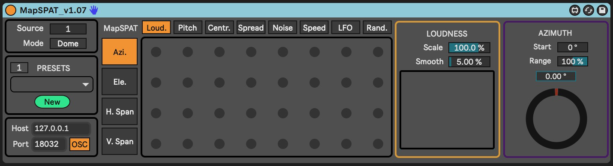

# MapSPAT

MapSPAT enables real-time spatialization through audio descriptor analysis. 

It is designed to address two needs: to create spatialization linked to sound's spectral variations and to allow real-time spatialization without relying on automations. This tool is helpful when planning all spatialization aspects before a concert is impractical or not preferred.

## Features

- Real-time spatialization through audio descriptor analysis:
  - Loudness, Pitch, Spectral Centroid, Spectral Spread, Noisiness.
- Mapping data obtained to spatial parameters related to sound location and size.
- Spatial parameters can also be controlled through an LFO function and a Random function.
- User-friendly interface requiring no programming skills.
- Hands-free operation for live performances, particularly advantageous while playing musical instruments.

## Usage

MapSPAT is a MaxForLive device that can be used in Ableton Live (10 and 11, and it should also work with Ableton Live 12) or as a stand-alone MaxMSP patch. It is based on FluCoMa audio descriptors (https://www.flucoma.org) and the SpatGRIS spatialization system (https://gris.musique.umontreal.ca/).

To use MapSPAT, you need to install SpatGRIS and audio routing software (such as BlackHole for Mac and Jackrouter for Windows) to send audio from Ableton Live to SpatGRIS. For more information on audio routing and SpatGRIS operation, refer to the SpatGRIS manual, which is available in the software's help window. Considering SpatGRIS's workflow, MapSPAT can be used instead of the ControlGRIS plugin.

To use MapSPAT:

1. Place the MapSPAT device on the Ableton Live audio track you intend to spatialize.
2. Set the numeric value of the source in MapSPAT to match the audio track in Ableton Live.
3. MapSPAT is now ready to analyze the incoming audio.
4. Activate the mappings in the matrix to send the spatialization OSC signals to SpatGRIS.

We recommend using the latest version of MaxMSP rather than the bundled version in Ableton Live.

A user manual is available here: [User Manual](MapSPAT-UserManual.pdf)

A demonstration Ableton Live project is available to explore the device's functions: [MapSPAT-Demo-Project](MapSPAT-Demo-Project)

## About

MapSPAT is developed by [Nicola Giannini](https://nicolagiannini.com) and [Jean-Philippe Jullin](https://github.com/jpjullin) at the Faculty of Music at the University of Montreal with the support of the Centre for Interdisciplinary Research in Music Media and Technology (CIRMMT) and the Fonds de recherche du Québec – Société et culture (FRQSC).
